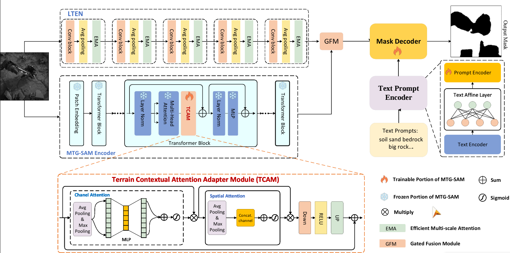

## MTSNet
This repository contains the code for **MTSNet: Joint Feature Adaptation and Enhancement for Text-Guided Multi-view Martian Terrain Segmentation**.



## General file descriptions
- model.py - model architectures defined here.
- LTEN.py - implementation of **Local Terrain Feature Enhancement Network (LTEN)**.
- GFM.py - implementation of **Gated Fusion Module (GFM)**.
- segment_anything/* - files for Segment Anything Model , and we define the   **Terrain Context Attention Adapter Module (TCAM)** in segment_anything/modeling/adapter.py.
- clip/* - files for CLIP model.
- model_components/ema.py - code for Efficient Multi-scale Attention used in LTEN block.

## Citing MTSNet
If you use MTSNet in your research, please use the following BibTeX entry.
```
@inproceedings{fang2024mtsnet,
  title={MTSNet: Joint Feature Adaptation and Enhancement for Text-Guided Multi-view Martian Terrain Segmentation},
  author={Fang, Yang and Rao, Xuefeng and Gao, Xinbo and Li, Weisheng and Zijian, Min},
  booktitle={ACM Multimedia 2024},
  year={2024}
}
```